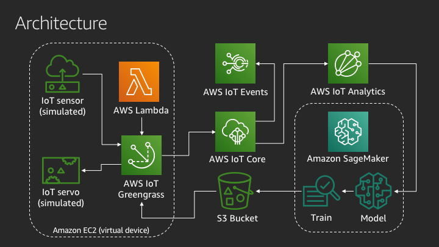

## Custom Time-series Forecasting for Predictive Maintenance

### What is this?

This repository contains the AWS CloudFormation template for a time-series forecasting solution that showcases how AWS IoT and Amazon SageMaker services can deliver an end-to-end IoT+ML project. The solution is utilized in the AWS re:Invent 2019 session **IoT-309 Combining IoT and Machine Learning for Predictive Maintenance**.

The repository also contains the Jupyter notebook file for reference. When deploying the CloudFormation template, the notebook will automatically be loaded into a SageMaker notebook instance for you.

### Who is it for?

This solution is for anyone interested in how an end-to-end solution works that combines the technologies of IoT and machine learning. You might be an IoT architect looking for guidance on how to incorporate model training and deployment. Or you might be a data scientist interested in where IoT data comes from and how models get used in the cyberphysical world.

### What does it do?

This solution ingests weather data from the [Beijing PM2.5](https://archive.ics.uci.edu/ml/datasets/Beijing+PM2.5+Data) data set as a simulated device running on IoT Greengrass and EC2, stores it in the cloud with IoT Core and IoT Analytics, trains a forecasting machine learning model from it with Amazon SageMaker, then deploys the model to the edge for local inferences with IoT Greengrass and Lambda. Additionally, we have included an IoT Events detector model that will trigger an alert if too many forecasts are made that fall outside an acceptable range.

### How do I use it?

Read on in the next section called *Deployment steps* for instructions on AWS account preparation, CloudFormation template deployment, and interactions that walkthrough the solution.

### How much does it cost?

The combined compute resources (EC2, SageMaker) provisioned by this solution cost up to $0.50 per hour. There are one-time charges for IoT metered use that total about $0.25. We recommend following the clean up steps once you've finished evaluating the solution, or at least stopping the compute resources when not in use.

## Deployment steps

### Prerequisites

In order to proceed, you will need access to an AWS account with a login that has AdministratorAccess. These permissions are required to deploy the template which creates additional IAM roles used by the solution. Due to the escalated permissions required, we recommend you do NOT deploy this solution in an account running your production services. A testing, sandbox, or personal account is recommended.

This solution was created specifically for the N. Virginia (us-east-1) region of AWS. Please use that region for this demonstration.

Before deploying the CloudFormation template, you must verify IoT Greengrass has a service role configured.

One further note: this solution creates a VPC to launch an EC2 instance that runs your Greengrass group. By default, AWS accounts are allotted 5 VPCs before requiring a limit increase. If your account is already using 5 VPCs, you will need to request an increase, delete one, or use a different account to proceed.

Markdown legend
* Labels in the UI to look for are *italicized*
* Buttons to click in the UI are **bold**
* Variable names, resource names, and text you need to enter appear `as code`.

#### Verify IoT Greengrass role
1. Go to Settings in the IoT console https://console.aws.amazon.com/iot/home?region=us-east-1#/settings. Scroll down to *Greengrass service role*.
2. If you see the statement "You do not have a service role attached to your AWS account in the current AWS Region." then you need to create and attach a service role. If you see the label *Current service role* and a named role below it, you can skip to the next section.
3. Click **Attach role***.
4. Either choose an existing service role to attach by selecting it and clicking **Save**, or if none are found click **Create role for me**.
5. Assuming you are creating a new role, then click **Grant permission**.
6. From either path in step 4, you should now be returned to the Settings page and can see a service role was attached.

### Deploying the CloudFormation template
1. Go to the CloudFormation console https://console.aws.amazon.com/cloudformation/home?region=us-east-1# and click on **Create stack**. 
1. Choose the template source as **Upload a template file** and upload the template.yml file from this repository.
1. Provide a *Stack name*. Please use only alphanumeric characters since we are using stack name in resource names at a few places. Leave the default parameters and click **Next**.
1. Leave all the default settings of stack policy and other attributes on this page and click **Next**.
1. Check the box for *I acknowledge that AWS CloudFormation might create IAM resources.* and click **Create Stack**.

CloudFormation will then provision AWS resources as defined by the template. This will take just a minute or two. You can move on to the next step when your CloudFormation stack shows as *CREATE_COMPLETE*.

If the stack does not deploy correctly, it will rollback any changes and your status would show as *ROLLBACK_COMPLETE*. In this case, click on the stack and review the Events to see which resource failed to create. Common reasons for CloudFormation failure include your AWS permissions were insufficient and deploying the template in an unsupported region (this solution requires N. Virgina us-east-1).

### Deploying configuration to Greengrass
1. After the template is successfully deployed, go to the Groups page of the Greengrass console 
https://console.aws.amazon.com/iot/home?region=us-east-1#/greengrass/grouphub.
1. You should see a Greengrass group named as `<StackName>GreengrassGroup`. Click the group to open the detail view.
1. Click the *Actions* dropdown and click **Deploy**. Select **Automatic detection** and wait for the Greengrass group to deploy. This is visible in the detail view header under the group name. 
1. It can take up to a few minutes and then you should see *Successfully completed* in the header.

If your group fails to deploy, the most likely cause is a missing service role. Double check the steps from the section *Verify IoT Greengrass role*.

### Ingesting historical data
1. Once the Greengrass group is deployed, go to the Test page of the IoT Core console 
https://console.aws.amazon.com/iot/home?region=us-east-1#/test. 
1. Subscribe to the topic `pollution/data`. 
1. Update the publish topic to `pollution/data/ingest/trigger` and click **Publish to topic** to send the default message. This will trigger the data ingestion Lambda function and you should see messages arrive on the `pollution/data` topic. The messages seen here are also forwarded to IoT Analytics via the IoT Core rules engine. 
1. Wait for the messages to stop getting published. This can take up to 15 minutes. Good time for a hydrate and stretch break! 

### Querying for ingested data
1. Go to the *Data sets* page of the IoT Analytics console https://console.aws.amazon.com/iotanalytics/home?region=us-east-1#/datasets
1. Find and click on the newly created data set prefixed with `iotanalyticssqldataset`.
1. Expand *Actions* and click **Run now**.
1. In a few seconds, you can see the preview of the data in the console.

As you can see from the query, we are querying all the ingested data (`select *`). Note that you should wait up to 5 minutes after messages finished publishing in IoT Core to make sure all data is loaded in the IoT Analytics data store before you run the query. This ensures you are working with the full data set in the following steps.

### Training in SageMaker
1. Go to the notebook instances page of the SageMaker console https://console.aws.amazon.com/sagemaker/home?region=us-east-1#/notebook-instances
1. Find the notebook instance prefixed with `SagemakerNotebookInstance`. Click on **Open Jupyter** for that instance. You will redirected to the Jupyter web interface, where you will find a Jupyter notebook. This notebook was created through the CloudFormation script with SageMaker lifecycle management.
1. Click on the notebook (file ending with .ipynb) to open it.

The next part of the walkthrough has you step through the notebook. The notebook itself documents the steps taking place. By the end of the notebook, you will have created a new machine learning model from the ingested data. You will use this model in the next section of the README.

Notes for the notebook:
* There is one step after the *Set-up: Import Required Notebook Libraries* where you need to uncomment a line and run it. As soon as you run this cell, comment the line again. Select *Kernel* in menu bar and click **Restart**. A dialogue box with appear, click **Restart**.
* When you reach the cell of *Model Training*, you may notice that we are using a SageMaker training job now to train the model. The trainLSTM.py file stored in Jupyter is a copy of this notebook in a vanilla Python format. This allows us to offload the work of packing the trained model to SageMaker.

### Deploying trained model to Greengrass
1. Go back to the Groups page of the Greengrass console https://us-east-1.console.aws.amazon.com/iot/home?region=us-east-1#/greengrass/grouphub
1. Select the group named `<StackName>GreengrassGroup`. Go to *Resources*,  select *Machine learning*, and click **Add a machine learning resource**.
1. Give a resource name like `lstmModel`, and click **Use a model trained in AWS SageMaker**. Select the training job you just trained prefixed with `pollution-forecasting-lstm`.
1. Give local path as `/dest/`.
1. Select Lambda affiliation, and pick the Lambda prefixed with `<StackName>-InferenceLambda`. Leave the Read-only access and click **Save**.
1. Expand *Actions* and click **Deploy**.
1. Wait for the group to be deployed. It can take up to a few minutes and then you should see *Successfully completed* in the header.

A failure here to deploy most likely means a permissions error in your Greengrass service role. Double check that either your S3 bucket name includes the text "greengrass" or "sagemaker". If it does not, then you will need to add a policy to your Greengrass service role that grants read access to objects in your S3 bucket.

### Testing inferences on the edge
1. Go to the *Test* page of the IoT Core console https://us-east-1.console.aws.amazon.com/iot/home?region=us-east-1#/test
1. Subscribe to two topics `pollution/data` and `pollution/data/infer`
1. Publish the default message to the topic `pollution/data/infer/trigger`. This will trigger the inference Lambda function which looks for the trained model and 
makes predictions on the test data.

You should see messages coming on both the subscribed topics. The messages arriving on `pollution/data` should look familiar as they are the same format of message you ingested earlier. The messages arriving on `pollution/data/infer` are new. These are messages published by the inference Lambda function which is using your new machine learning model to predict the pollution value. You can see how accurate the prediction is by comparing it to the actual value for that measurement.

### Cleaning up
To clean up the resources, you need to perform two manual steps before you can delete the CloudFormation stack:

#### Reset deployments on Greengrass
1. Go to the *Groups* page of the Greengrass console https://us-east-1.console.aws.amazon.com/iot/home?region=us-east-1#/greengrass/grouphub
1. Click on the group with name `<StackName>GreengrassGroup`.
1. Select *Actions* and click **Reset deployments**. A dialogue box will appear. Click **Reset deployment**.

#### Clean up S3 bucket
1. Go to the CloudFormation console https://console.aws.amazon.com/cloudformation/home?region=us-east-1#/stacks and select your stack. Go to *Resources*.
1. Search for `S3Bucket` in the search bar, and click on the link of the physical id. 
1. You will be redirected to the S3 console for the bucket. Select all folders named `data` and prefixed with `pollution-forecaseting-lstm`. Click on *Actions* and **Delete**.

### Delete CloudFormation stack
1. Go to the CloudFormation console https://console.aws.amazon.com/cloudformation/home?region=us-east-1#/stacks and select your stack. 
1. Click **Delete**.

## License

This library is licensed under the MIT-0 License. See the LICENSE file.

